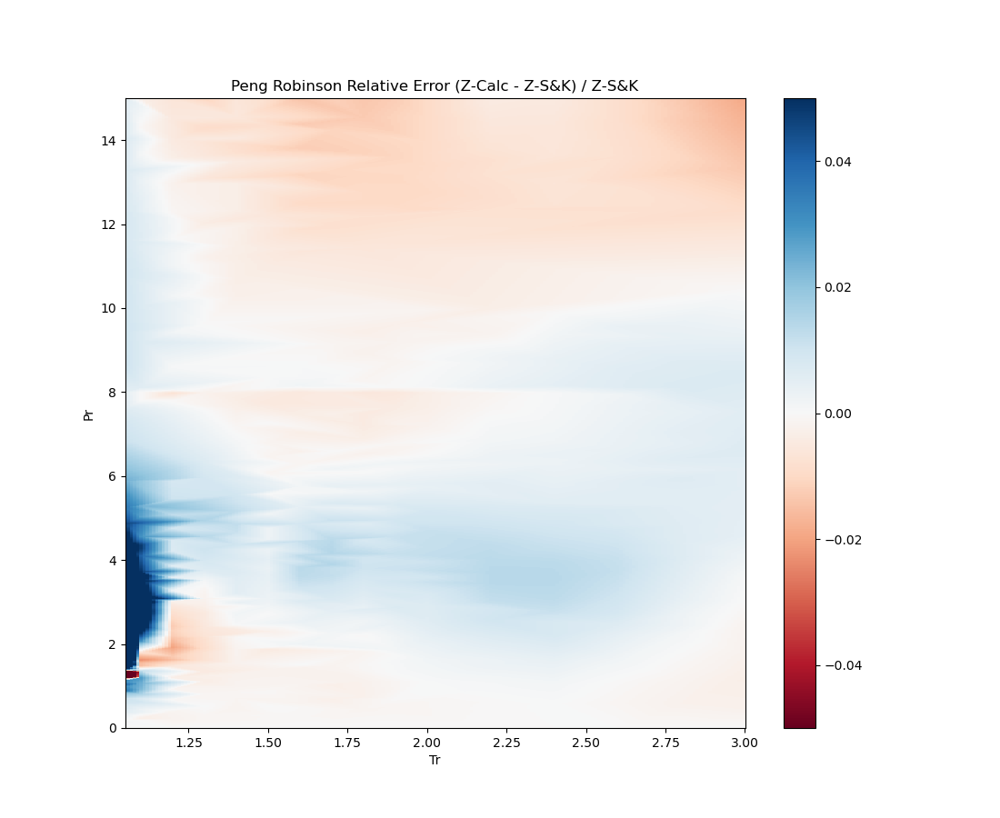
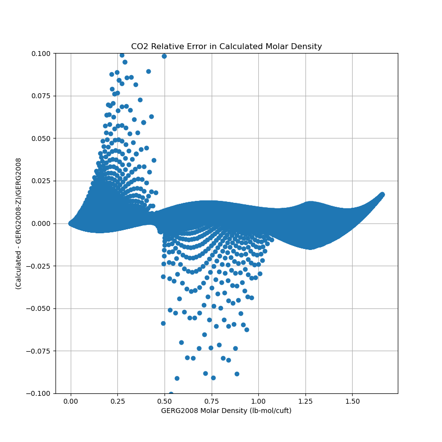
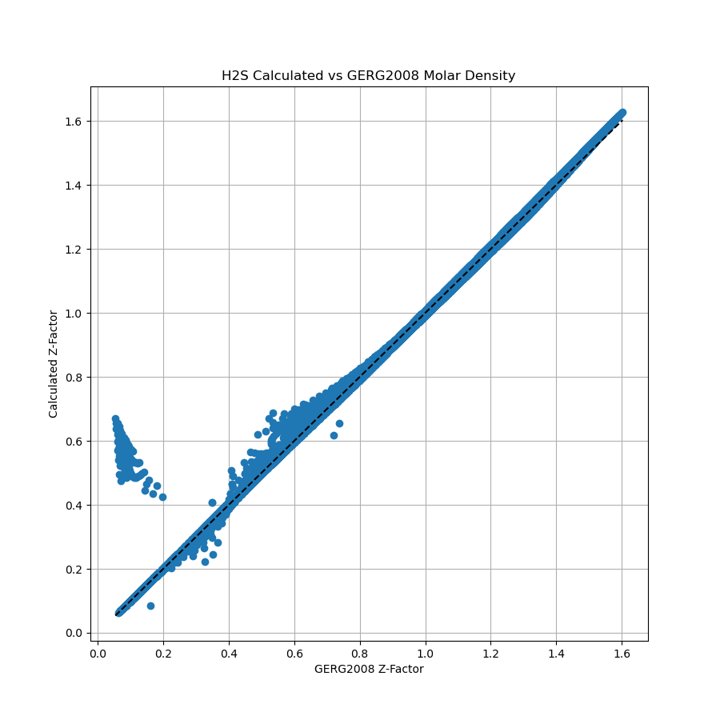
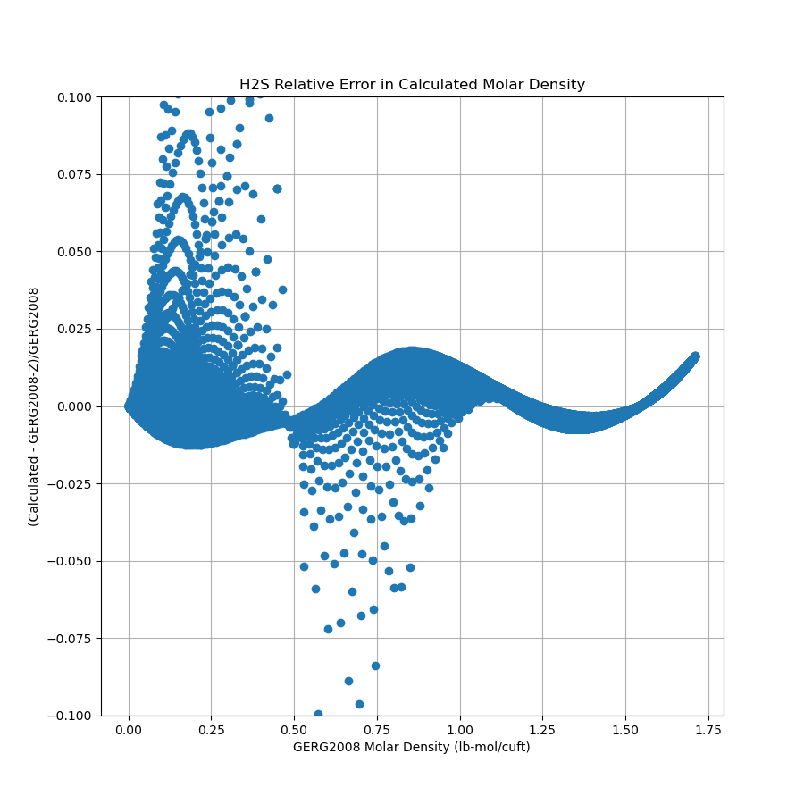
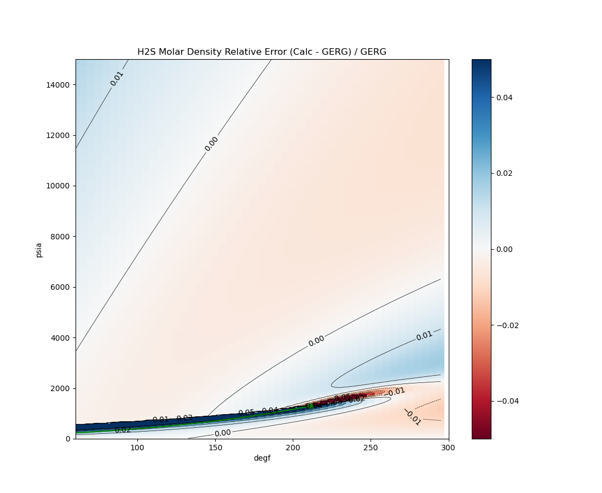
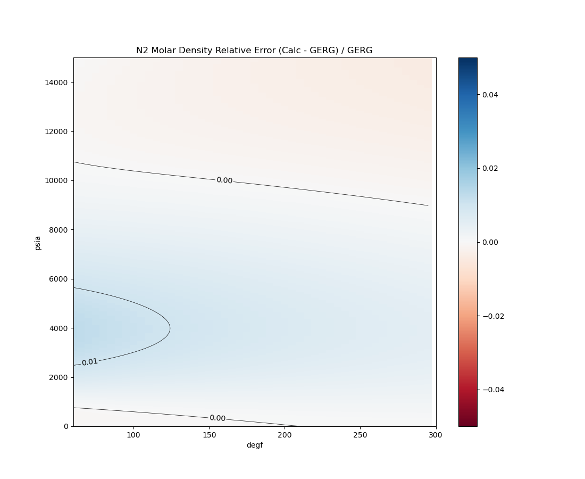

# Improving the Single Component Peng-Robinson Z-Factor Approach for Inerts

**Author**: Mark Burgoyne  
**First released**: 05-04-2024  
**First Update**: 27-04-2024  
**Second Update**: 05-05-2024  
**Third Update**: 26-05-2024

Following feedback from Curtis Whitson and Simon Tortike, I explored the potential of extending the single-component Peng-Robinson Z-Factor method to explicitly incorporate inerts. This was driven by two main considerations: 
1. The accuracy of my original single-component model was inherently limited by the choice of critical pressure and temperature correlation.
2. As we increasingly encounter scenarios such as CCUS with high inert concentrations, a simplified yet accurate approach is needed to handle up to 100% inerts - beyond the range tested with approaches such as Wichert & Aziz.

## Evolution of work
- Original Single component PR EOS model for hydrocarbon gas in reduced temperature and pressure space (per [Linkedin post 5th April 2024](https://www.linkedin.com/pulse/z-factors-natural-gas-simple-eos-based-approach-mark-burgoyne-aazrc))
- Fist update for inerts (per [Linkedin post 27th April 2024](https://www.linkedin.com/pulse/improving-single-component-peng-robinson-z-factor-inerts-burgoyne-zfxcc)) fitted constant BIP’s between inert and hydrocarbon pairs.  
- Second update of this work (5th May 2024), delivered additional functionality/accuracy including:
  1. All BIP pairs temperature dependent
  2. Hydrocarbon MW dependent adjustments for Hydrocarbon : Inert BIP pairs
  3. Implemented LBC viscosity calculations, tuned for up to 100% mole fraction of natural gas or inerts
- Third update of this work (19th May 2024, with current GitHub content), delivered additional functionality/accuracy including:
  1. Refitted all inert critical properties to GERG2008, including efforts to minimize OmegaA/B deviations from default for CO2
  2. Refitted inert temperature dependant pairs to GERG2008 data (previously used noisy Wichert data)
  3. Updated all knock-on coefficients and dependancies, and added a few non-Wichert data points at elevated temperature and gas richness.

## Data Sources used

- **Standing & Katz Z-Factors for pure hydrocarbon gas**
  - Digitized 515 Z-Factor data points from original Standing & Katz plot found in SPE-942140 - "Density of Natural Gases"  
- **Pure inert critical parameters and viscosity**
  - Generated GERG2008 EOS data for pure CO2, H2S, and N2, across temperatures of 50-300°F and pressures of 14.7-15,000 psia. Densities were converted into Z-Factors, and along with viscosities tabulated.
- **Mixture properties for fitting temperature dependent inert:inert BIP pairs**
  - A GERG2008 multicomponent model was used to create 4,990 mixture Z-Factor data points over the temperature range 90 – 300 degF and 14.7 – 15,000 psia, and various CO2, H2S, N2 mole fractions
- **Mixture properties for fitting MW and temperature dependent HC:inert BIP pairs**
  - 1,061 Z-factor measurements were digitized from 89 samples detailed in Wichert’s 1970 thesis, which covered mixtures containing 0-54.5% CO2, 0-73.9% H2S, and 0-25.2% N2
- **Pure Viscosities for LBC Regression**
  - Paired GERG2008 viscosities from each of the inert Z-Factor data points were used, along with 24,000 synthetic natural gas viscosities using the Lee Gonzalez and Eakin correlation over the range of 0.5 - 2.0 SG, 14.7 – 15,000 psia and 60 – 300 degF

## Steps

1. With Peng-Robinson equation of state (EOS), regress single component hydrocarbon gas critical properties to digitized Standing & Katz Z-Factor data in reduced temperature and pressure space.
2. Regress Volume Shift for CO2, N2, and H2S, and adjusting the OmegaA and OmegaB parameters for CO2 to match GERG2008 inerts Z-Factors. CO2 was the most challenging to model accurately, yet the approach achieved better than 1% average error and maintained less than 5% error for 99% of the data points, except near the critical point.
3. Regress temperature dependent inert BIP pairs to GERG2008 mixture data.
4. Simultaneously regress (a) HC:Inert temperature and MW dependent BIP pairs and (b) Sutton critical property coefficients to the Wichert Z-Factor data, using a form as follows: `BIP = A + B / DegR + C * HC_MW`.
5. Regress VCVIS of all components, including hydrocarbon gas at differing hydrocarbon MW’s to both the GERG2008 data (inerts) as well as synthetic Lee Gonzalez and Eakin viscosity data for pure hydrocarbon, while also investigating custom 3rd and 4th LBC coefficients.

## Results

**Critical parameters**

| Comp | MW    | Tc (R)  | Pc (psia) | ACF     | VTRAN   | OmegaA  | OmegaB   | VcVis (ft³/lbmol)|
|------|-------|---------|-----------|---------|---------|---------|----------|------------------|
| CO2  | 44.01 | 547.416 | 1069.51   | 0.13888 | -0.17078| 0.440853| 0.0730166| 1.47133          |
| H2S  | 34.082| 672.12  | 1299.97   | 0.01839 | -0.22294| 0.441796| 0.0739200| 1.53276          |
| N2   | 28.014| 227.16  | 492.84    | 0.03700 | -0.20976| 0.457236| 0.0777961| 1.37901          |
| Gas  | *     | *       | *         | -0.04896| -0.3949 | 0.429188| 0.069255 | *                |

**Properties are MW dependent*

mw_hc = Inert free hydrocarbon gas MW  
`Gas Tc (R) = coefic_tc[0] * mw_hc ** 2 + coefic_tc[1] * mw_hc + coefic_tc[2]`  
`Gas Pc (psia) = coefic_pc[0] * mw_hc ** 2 + coefic_pc[1] * mw_hc + coefic_pc[2]`  
`Gas VcVis (ft³/lbmol) = 0.066371826 * mw_hc + 0.35317119`  
`coefic_tc = [0, 8.26506, 211.364]`  
`coefic_pc = [0, -2.76138, 705.295]`  
`LBC P3 = -3.98866e-02`  
`LBC P4 = 9.26531e-03`  

| BIP Pair Parameters: A | H2S                             | N2              | Gas                  |
|------------------------|---------------------------------|-----------------|----------------------|
| CO2                    | 0.000160492(a), 0.040933216(b)  | -0.061940854    | 2.58604e-01          |
| H2S                    |                                 | -0.836144851    | -7.22523e-02         |
| N2                     |                                 |                 | -1.44878e+00         |

| BIP Pair Parameters: B | H2S                             | N2              | Gas                  |
|------------------------|---------------------------------|-----------------|----------------------|
| CO2                    | 0.056787492(a), 2.454878276(b)  |-0.494913095     | 7.33735              |
| H2S                    |                                 | 2.80825315      | 70.7683              |
| N2                     |                                 |                 | 453.317              |

| BIP Pair Parameters: C | H2S                             | N2              | Gas                  |
|------------------------|---------------------------------|-----------------|----------------------|
| CO2                    |                                 |                 | -1.31205e-02         |
| H2S                    |                                 | 348.2693873     | 4.18843e-03          |
| N2                     |                                 |                 | 2.06268e-02          |

`H2S:CO2 BIP = max(A * degF + B (a), 1/(A * degF + B)) (b)`  ,
`CO2:N2 BIP = 1/(A * degF + B)`  ,
`H2S:N2 BIP = A + (degF * B)/(C * degF)`  ,
`Hydrocarbon:Inert BIPs = A + B / DegR + C * mw_hc`  

# Pure Hydrocarbon Gas Residual Error Plots

|  |
|----------------------------------------------------------------------|
|                  |
[Uploading Inerts_PR_Match_VSHIFT_Only_AB_CO2_BigLoop_BIPS_Temp_reduced_MW_Slope4_Linear_v3.phz…]()

# Pure CO2 Residual Error Plots

|  |      |
|------------------------------------------------------------------|--------------------------------------------------|
|                           |  |

# Pure H2S Residual Error Plots

|  |      |
|------------------------------------------------------------------|--------------------------------------------------|
|                           |  |

# Pure N2 Residual Error Plots

|  |      |
|-----------------------------------------------------------------|-------------------------------------------------|
|                           |  |

# Wichert Z-Factor Residual Error Plots

|       |
|----------------------------------------------------------------------------------------------------------|
| **Peng Robinson Avg Rel. Error:** -0.001, **Max rel. Error:** 0.08, **95% of rel. errors < :** 0.0205   **DAK + Sutton & Wichert Avg Rel. Error:** 0.009, **Max rel. Error:** 0.13, **95% of rel. errors < :** 0.0398   **DAK + PMC Avg Rel. Error:** 0.005, **Max rel. Error:** 0.157, **95% of rel. errors < :** 0.0358 |
|  |  |

## Additional Resources

All the datasets used for these regressions have been uploaded for public access. To replicate these findings, you will need to download and install Aaron Zicks’ PhazeComp software, which will run these models with the free functionality. I strongly encourage those interested in deepening their understanding of EOS modelling to invest time in mastering this software.
