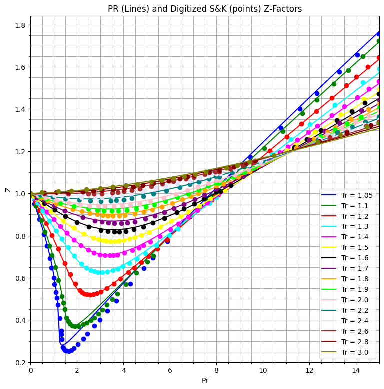
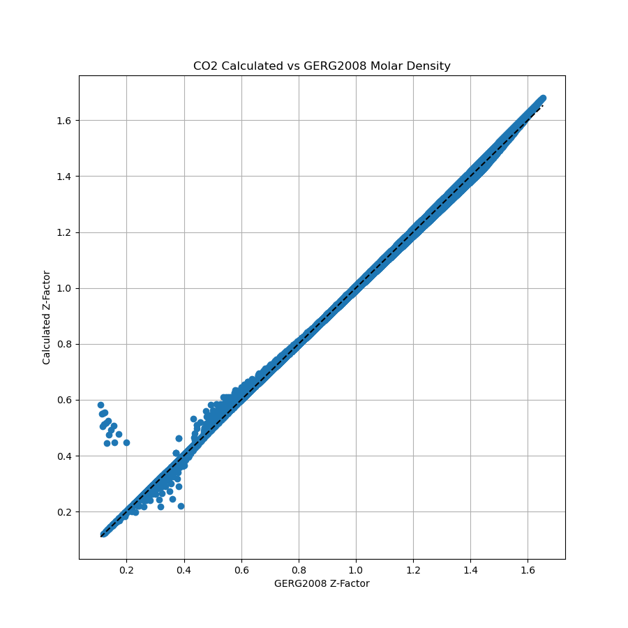
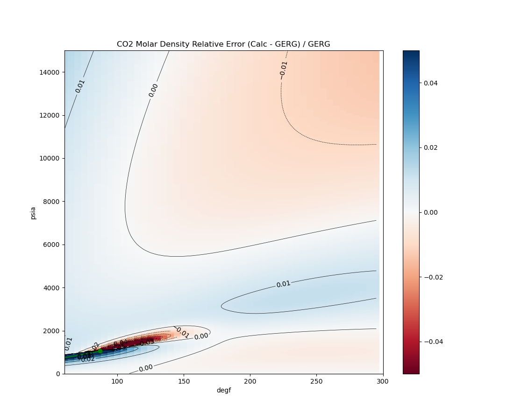
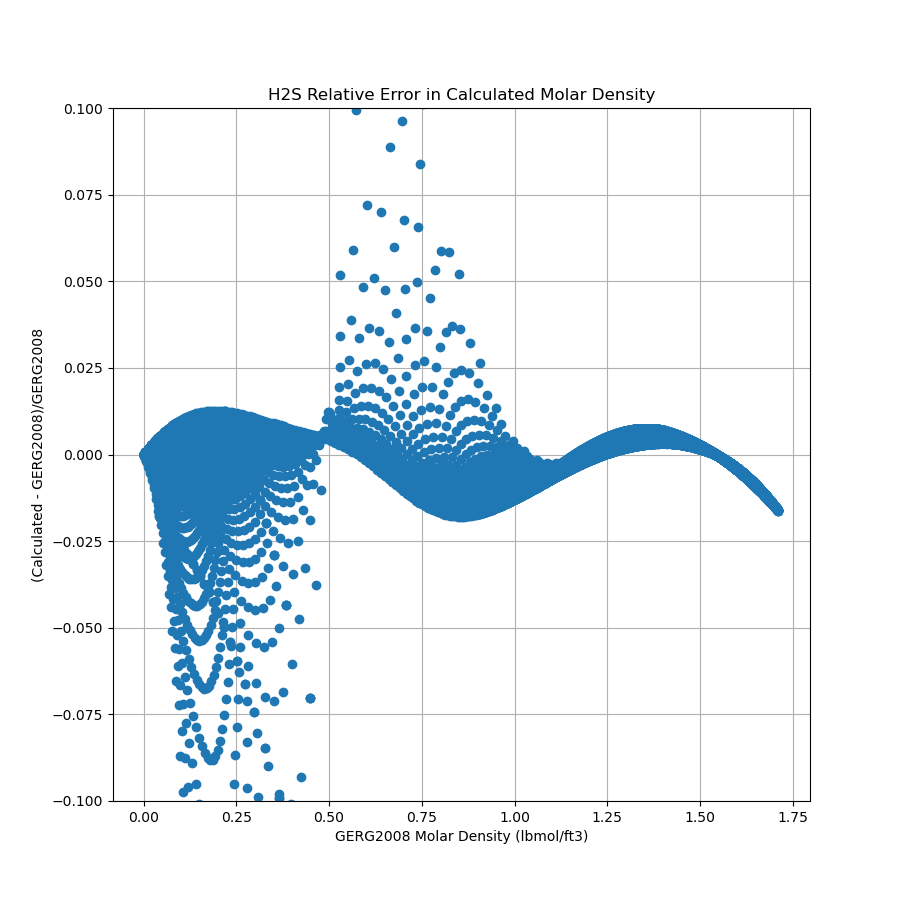
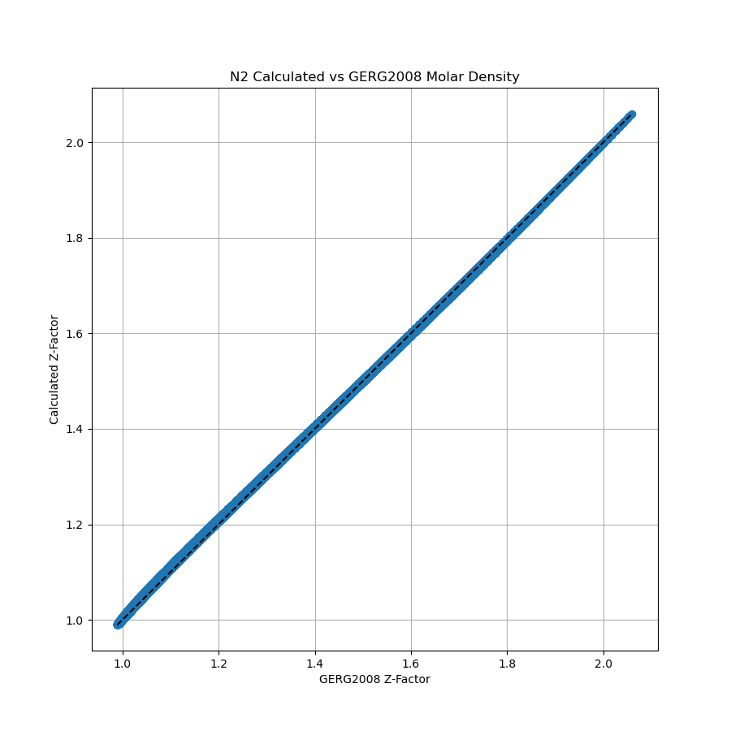
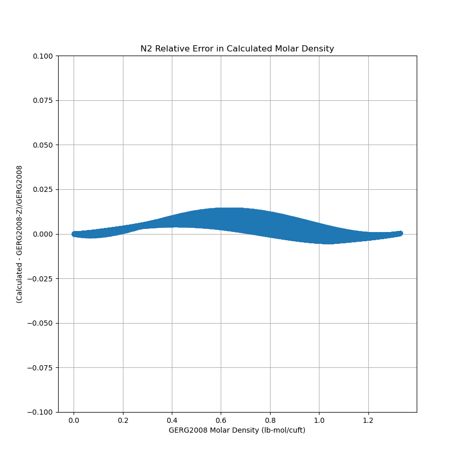
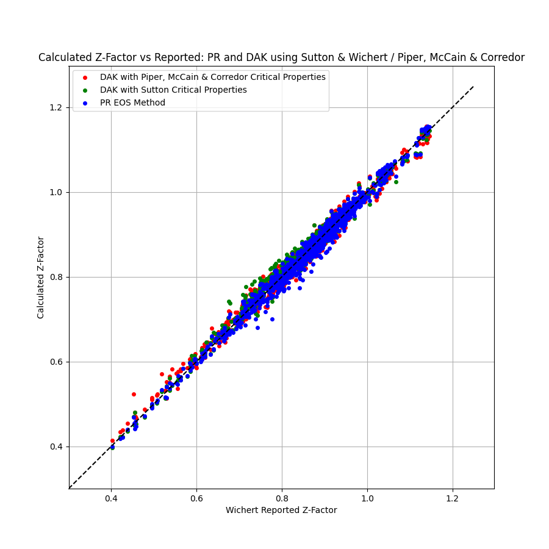
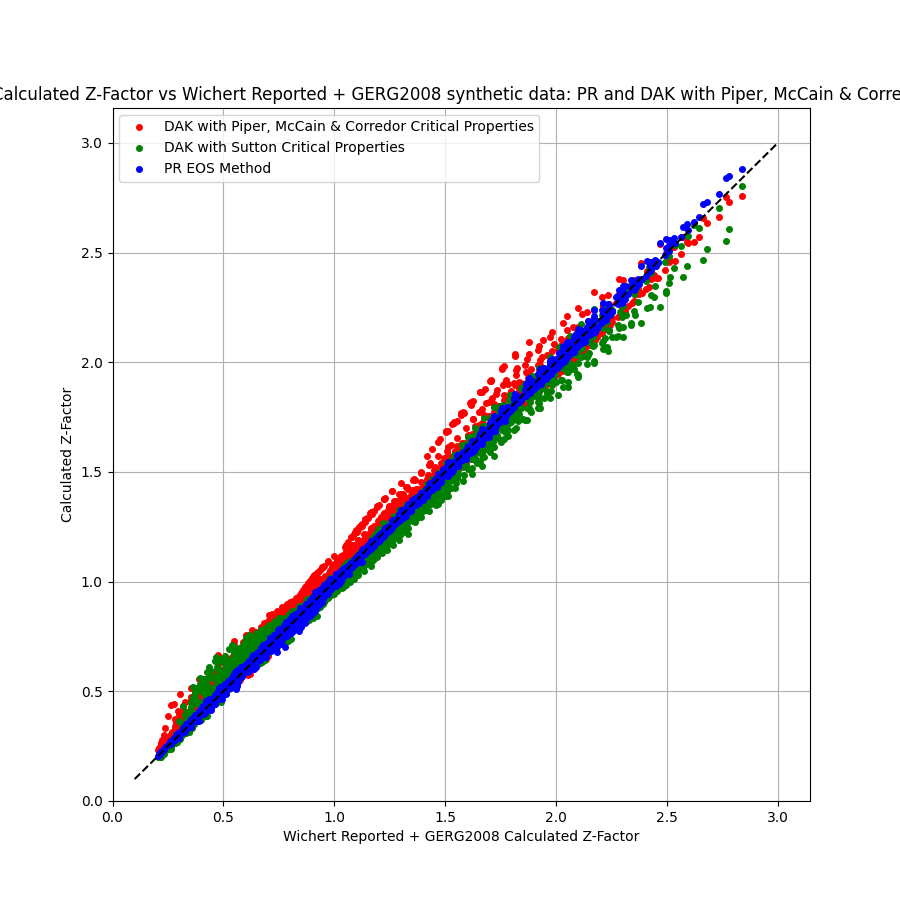
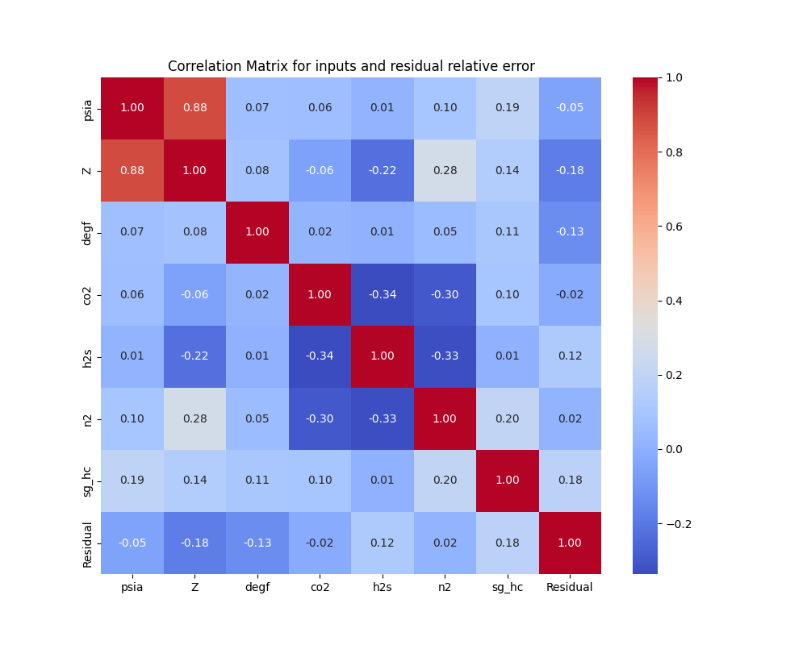

# Improving the Single Component Peng-Robinson Z-Factor Approach for Inerts

**Author**: Mark Burgoyne  
**First released**: 05-04-2024  
**First Update**: 27-04-2024  
**Second Update**: 05-05-2024  
**Third Update**: 19-05-2024 -> 05-06-2024

**Fourth Update**: 15-06-2024

Following feedback from Curtis Whitson and Simon Tortike, I explored the potential of extending the single-component Peng-Robinson Z-Factor method to explicitly incorporate inerts. This was driven by two main considerations: 
1. The accuracy of my original single-component model was inherently limited by the choice of critical pressure and temperature correlation.
2. As we increasingly encounter scenarios such as CCUS with high inert concentrations, a simplified yet accurate approach is needed to handle up to 100% inerts - beyond the range tested with approaches such as Wichert & Aziz.

Additional discussions with Markus Hayes Neilsen prompted me to extend the approach to incorporate Hydrogen as well

A ‘simple’ tuned Peng Robinson model scheme, complete with binary interaction coefficients as a function of temperature and hydrocarbon gas MW, and hydrocarbon Tc and Pc as a function of hydrocarbon gas MW.
By assuming single phase gas, we do not need to do flash calculations, solving only for maximum real root of the cubic equation.
Instead of using conventional correlations such as Sutton & Wichert Aziz or PMC that estimate Tc and Pc from MW of the gas mixture and applying corrections to Tc & Pc correlations for inerts, this approach treats hydrocarbon gas, CO2, H2S, N2 and H2 as distinct species, permitting more reliable application at inert fractions up to and including 1.0.

## Key differentiators include
  1.	Non iterative, intrinsically stable solution scheme well suited to analytical applications
  2.	Broad applicability to up to 100% Nitrogen, CO2, H2S or H2, making it well suited to not only standard oilfield gas, but also scoping storage injection studies.
  3.	Based upon industry standard cubic EOS, enabling greater confidence to use over wide P, T range.
  4.	Results can be replicated with any industry standard applications that support PR EOS with volume translation.
  5.	Complete with a paired tuned LBC viscosity model that is similarly applicable over wide ranges of P, T and composition.

## Evolution of work
- Original Single component PR EOS model for hydrocarbon gas in reduced temperature and pressure space (per [Linkedin post 5th April 2024](https://www.linkedin.com/pulse/z-factors-natural-gas-simple-eos-based-approach-mark-burgoyne-aazrc))
- Fist update for inerts (per [Linkedin post 27th April 2024](https://www.linkedin.com/pulse/improving-single-component-peng-robinson-z-factor-inerts-burgoyne-zfxcc)) fitted constant BIP’s between inert and hydrocarbon pairs.  
- Second update of this work (5th May 2024), delivered additional functionality/accuracy including:
  1. All BIP pairs temperature dependent
  2. Hydrocarbon MW dependent adjustments for Hydrocarbon : Inert BIP pairs
  3. Implemented LBC viscosity calculations, tuned for up to 100% mole fraction of natural gas or inerts
- Third update of this work (19th May - 5th June 2024, with current GitHub content), delivered additional functionality/accuracy including:
  1. Reverted to a single component gas EOS fit that avoided changing Omega values
  2. Refitted all inert critical properties to GERG2008, including efforts to minimize OmegaA/B deviations from default for CO2
  3. Refitted inert temperature dependant pairs to GERG2008 data (previously used noisy Wichert data)
  4. Updated all knock-on coefficients and dependancies. Augmented data to fit against with four synthetic gas samples at various richnesses and inert fractions using the GERG2008 EOS.
- Fourth update of this work (15th June, with current GitHub content):
  1. Retuned inerts and hydrocarbon single component critical parameters to minimize deviance from standard critical properties
  2. Added support for Hydrogen (critical paremeters and BIP pairs)

## Data Sources used

- **Standing & Katz Z-Factors for pure hydrocarbon gas**
  - Digitized 515 Z-Factor data points from original Standing & Katz plot found in SPE-942140 - "Density of Natural Gases"  
- **Pure inert critical parameters**
  - Generated GERG2008 EOS data for pure CO2, H2S, N2, and H2 across temperatures of 50-300°F and pressures of 14.7-15,000 psia. Densities were converted into Z-Factors, and along with viscosities tabulated.
- **Mixture properties for fitting temperature dependent inert:inert BIP pairs**
  - A GERG2008 multicomponent model was used to create 4,990 mixture Z-Factor data points over the temperature range 90 – 300 degF and 14.7 – 15,000 psia, and various CO2, H2S, N2, H2 mole fractions
- **Mixture properties for fitting MW and temperature dependent HC:inert BIP pairs**
  - 1,061 Z-factor measurements were digitized from 89 samples detailed in Wichert’s 1970 thesis, which covered mixtures containing 0-54.5% CO2, 0-73.9% H2S, and 0-25.2% N2
  - An additional ~45,000 data points were also generated using the GERG2008 model for synthetic hydrocarbon gas mixtures with MW's of 16, 26, 34 and 45 lb/lb-mol, paired with 0.25 - 0.75 mole fraction inerts in order to better constrain / describe fits to (a) higher hydrocarbon gas MW's and (b) higher inert fractions.
- **Pure Viscosities for LBC Regression**
  - Pure NIST viscosities from each of the inerts were used, along with 24,000 synthetic natural gas viscosities using the Lee Gonzalez and Eakin correlation over the range of 0.5 - 2.0 SG, 14.7 – 15,000 psia and 60 – 300 degF

## Steps

1. With Peng-Robinson equation of state (EOS), regress single component hydrocarbon gas critical properties to digitized Standing & Katz Z-Factor data in reduced temperature and pressure space.
2. Regress Volume Shift for CO2, N2, and H2S, and adjusting the OmegaA and OmegaB parameters for CO2 to match GERG2008 inerts Z-Factors. CO2 was the most challenging to model accurately, yet the approach achieved better than 1% average error and maintained less than 5% error for 99% of the data points, except near the critical point.
3. Regress temperature dependent inert BIP pairs to GERG2008 mixture data.
4. Simultaneously regress (a) HC:Inert temperature and MW dependent BIP pairs and (b) Sutton critical property coefficients to the Wichert and synthetic GERG Z-Factor data.
5. Regress VCVIS of all components, including hydrocarbon gas at differing hydrocarbon MW’s to both the GERG2008 data (inerts) as well as synthetic Lee Gonzalez and Eakin viscosity data for pure hydrocarbon, while also investigating custom 3rd and 4th LBC coefficients.

## Results

**Critical parameters**

| Comp | MW    | Tc (R)  | Pc (psia) | ACF     | VTRAN   | OmegaA  | OmegaB   | VcVis (ft³/lbmol)|
|------|-------|---------|-----------|---------|---------|---------|----------|------------------|
| CO2  | 44.01 | 547.416 | 1069.51   | 0.13888 | -0.17078| 0.440853| 0.0730166| 1.49254          |
| H2S  | 34.082| 672.12  | 1299.97   | 0.01839 | -0.22294| 0.441796| 0.0739200| 1.55582          |
| N2   | 28.014| 227.16  | 492.84    | 0.03700 | -0.20976| 0.457236| 0.0777961| 1.40419          |
| Gas  | *     | *       | *         | -0.04051| -0.19185| 0.457236| 0.0777961| *                |

**Properties are MW dependent*
mw_hc = Inert free hydrocarbon gas MW  

| Variable   | Tc             | Pc              |
|------------|----------------|-----------------|
| A          | 4.37303        |   -2.36286      |
| B          | 49.6062        | 1153.92         |
| C          |  0.00126240593 | 0.000686956691  |
| D          |  0.333600083   |    1.69866602   |

`Gas Tc (R) = (A * mw_hc + B)/(C * mw_hc + D)`  
`Gas Pc (psia) = (A * mw_hc + B)/(C * mw_hc + D)`  
`Gas VcVis (ft³/lbmol) = 0.064704349 * mw_hc + 0.416846`  
`LBC P3, P4 = -3.99829e-02, 9.29543e-03`  

| BIP Pair Parameters: A | H2S                             | N2              | Gas                  |
|------------------------|---------------------------------|-----------------|----------------------|
| CO2                    | 0.000160492(a), 0.040933216(b)  | -0.061940854    | 0.385078             |
| H2S                    |                                 | -0.836144851    | 0.279239             |
| N2                     |                                 |                 | 0.342281             |

| BIP Pair Parameters: B | H2S                             | N2              | Gas                  |
|------------------------|---------------------------------|-----------------|----------------------|
| CO2                    | 0.056787492(a), 2.454878276(b)  |-0.494913095     | -163.317             |
| H2S                    |                                 | 2.80825315      | -82.1543             |
| N2                     |                                 |                 | -202.531             |

| BIP Pair Parameters: C | H2S                             | N2              | Gas                  |
|------------------------|---------------------------------|-----------------|----------------------|
| CO2                    |                                 |                 | -0.00152913          |
| H2S                    |                                 | 348.2693873     | -0.00391989          |
| N2                     |                                 |                 | -0.000400542         |

`H2S:CO2 BIP = max(A * degF + B (a), 1/(A * degF + B)) (b)`  ,
`CO2:N2 BIP = 1/(A * degF + B)`  ,
`H2S:N2 BIP = A + (degF * B)/(C * degF)`  ,
`Hydrocarbon:Inert BIPs = A + B / DegR + C * mw_hc`  

# Pure Hydrocarbon Gas Residual Error Plots

|  |
|----------------------------------------------------------------------|
|                  |
[Uploading Inerts_PR_Match_VSHIFT_Only_AB_CO2_BigLoop_BIPS_Temp_reduced_MW_Slope4_Linear_v3.phz…]()

# Pure CO2 Residual Error Plots

|  |      |
|------------------------------------------------------------------|--------------------------------------------------|
|                           |  |

# Pure H2S Residual Error Plots

|  |      |
|------------------------------------------------------------------|--------------------------------------------------|
|                           |  |

# Pure N2 Residual Error Plots

|  |      |
|-----------------------------------------------------------------|-------------------------------------------------|
|                           |  |

# Wichert Z-Factor Cross Plots

|  |     |
|-----------------------------------------------------------------------------------------------------|--------------------------------------------------|
|                          |   |

| Method (vs Wichert data only) | Avg Rel. Error | Max Rel. Error | 95% of rel. errors < |
|-------------------------------|----------------|----------------|----------------------|
| Peng Robinson                 | 0.002          | 0.074          | 0.0321               |
| DAK + Sutton & Wichert        | 0.007          | 0.097          | 0.0336               |
| DAK + PMC                     | 0.004          | 0.157          | 0.0349               |

| Method (vs Wichert & GERG data) | Avg Rel. Error | Max Rel. Error | 95% of rel. errors < |
|---------------------------------|----------------|----------------|----------------------|
| Peng Robinson                   | 0.001          | 0.074          | 0.0277               |
| DAK + Sutton & Wichert          | 0.003          | 0.359          | 0.0618               |
| DAK + PMC                       | 0.024          | 0.651          | 0.122                |

|  |  |

## Additional Resources

All the datasets used for these regressions have been uploaded for public access. To replicate these findings, you will need to download and install Aaron Zicks’ PhazeComp software, which will run these models with the free functionality. I strongly encourage those interested in deepening their understanding of EOS modelling to invest time in mastering this software.
